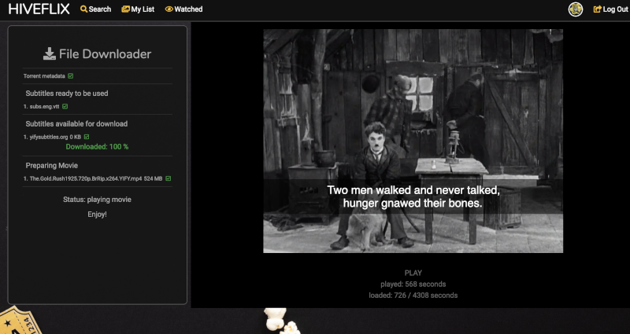

# About
Service that allows user to browse and search for movies, initiate their downloading to the server (via BitTorrent), and view the movie while it's downloading (with subtitles in the user's preferred language, if available).

Made with @Gamala, @josiz & @timohive.

# Instructions
```shell
git clone https://github.com/kimsappi/hypertube
cd hypertube
# Edit backend/src/config.secret.sample with correct values
# At the very least MONGODB_URI is required for any kind of functionality
npm run install-all
npm run dev
```
After that, a browser tab should open at http://localhost:3000 (with the backend at :5000). If you wish to change the ports or host this somewhere, `frontend/src/config` must be edited with the correct `SERVER_URL` and `backend/src/config.public.json` with the correct `CLIENT_URL`.

NB some of the tests are knowingly broken.

# So, how can I use it?
This project will not be deployed on the web because of its 'questionable' legality, so here are some screenshots instead.




# Features/requirements

## Tech
- [x] Firefox and Chrome compatibility
- [x] Layout: header, body, footer
- [x] Mobile-friendly layout
- [x] **No errors, warnings or logs**

## Security
- [x] Password encryption
- [x] XSS prevention => React
- [x] Form data must be validated
- [x] Disallow uploading unwanted content
- [x] SQL injection prevention => NoSQL/Mongoose + sanitiser

## User
- [x] Registration with email, username, first & last names, password (reasonably complex)
- [x] Authentication must be possible via 42 API and another Oauth API
- [x] 'Forgot password' feature (email)
- [x] Ability to log out in 1 click from any page
- [x] Ability to choose a preferred language (English by default)
- [x] Modify email address, **profile picture** and other info
- [x] Browse the profiles of other users (email must not be shown)

## Search
- [x] Search must be conducted on 2 torrent listing sites
- [x] Search must be limited to videos
- [x] Must be able to suggest the most popular videos from the sources before a search query is performed (criteria can be downloads, peers, seeders...)
- [x] Thumbnails of videos must be shown
- [x] Results must be sorted by name
- [x] Thumbnail must include production year, IMDb 'note' (score?) (Try to make sense of this: 'In addition to the name of the video, a thumbnail must be composed, if available, of its production year, its IMDb note and a cover image.)')
- [x] Previously watched videos must be labeled
- [x] Results must be paginated, pagination must be through AJAX (infinite scroll / buttons possibly allowed?)
- [x] Results must be sortable and filterable by name, genre, IMDb score, production year, ...

## Video
- [x] Display summary, main cast (producer, director, stars), year, length, IMDb score, 'cover story'(????)
- [x] Videos must be commentable
- [x] If file does not exist on the server, download must be initiated
- [x] Streaming must start when download is far enough that user won't need to buffer
- [x] Videos not watched in the last month must be deleted
- [x] English subtitles must be downloaded if available
- [x] If movie is not in user's preferred language, subtitles will need to be downloaded
- [x] If video is not `mp4` or `webm`, it must be converted on the server (at least `mkv` support is *required*)
